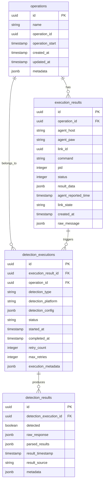

# Database Design Documentation

## Overview

This document describes the PostgreSQL database schema for the Checking Engine system that processes adversary emulation results from MITRE Caldera and executes detection queries against various security controls.

## Database Setup

### Connection Information

The system uses the following PostgreSQL database configuration:

- **Host**: localhost
- **Port**: 5432 (default)
- **Database**: caldera_purple
- **Username**: db_caldera
- **Password**: [configured separately]
- **Schema**: checking_engine (dedicated schema for isolation)

### Setup Scripts

All database setup scripts are located in the `setup/db_setup` directory:

- `setup/db_setup/00_create_schema.sql` - Creates the `checking_engine` schema and user permissions
- `setup/db_setup/01_create_tables.sql` - Creates all tables and constraints in the schema
- `setup/db_setup/02_create_indexes.sql` - Creates performance indexes
- `setup/db_setup/03_create_extensions.sql` - Installs required PostgreSQL extensions
- `setup/db_setup/04_sample_data.sql` - Optional sample data for testing
- `setup/db_setup/run_setup.sh` - Bash script to execute all setup files in order

To initialize the database, run:

```bash
cd setup/db_setup/
./run_setup.sh
```

## Architecture

The database uses a dedicated `checking_engine` schema for isolation and is designed to support:
- Storage of RED team execution results from Caldera operations
- Management of BLUE team detection executions across multiple platforms
- Flexible detection configuration for API queries and agent commands
- Extensibility for future detection types and platforms

## Schema Design

### Entity Relationship Diagram



## Table Definitions

### 1. operations

Stores information about Caldera operations.

```sql
CREATE TABLE operations (
    id UUID PRIMARY KEY DEFAULT gen_random_uuid(),
    name VARCHAR(255) NOT NULL,
    operation_id UUID NOT NULL UNIQUE,  -- Original Caldera operation ID
    operation_start TIMESTAMPTZ,
    created_at TIMESTAMPTZ DEFAULT NOW(),
    updated_at TIMESTAMPTZ DEFAULT NOW(),
    metadata JSONB DEFAULT '{}'::jsonb  -- Additional operation context
);

COMMENT ON TABLE operations IS 'MITRE Caldera operations metadata';
COMMENT ON COLUMN operations.operation_id IS 'Original operation ID from Caldera';
COMMENT ON COLUMN operations.metadata IS 'Extensible JSON field for additional operation data';
```

### 2. execution_results

Stores RED team command execution results from Caldera agents.

```sql
CREATE TABLE execution_results (
    id UUID PRIMARY KEY DEFAULT gen_random_uuid(),
    operation_id UUID NOT NULL REFERENCES operations(operation_id),
    agent_host VARCHAR(255),
    agent_paw VARCHAR(255),
    link_id UUID NOT NULL,  -- Caldera link ID
    command TEXT,
    pid INTEGER,
    status INTEGER,
    result_data JSONB,  -- Contains stdout, stderr, exit_code
    agent_reported_time TIMESTAMPTZ,
    link_state VARCHAR(50),  -- SUCCESS, FAILED, etc.
    created_at TIMESTAMPTZ DEFAULT NOW(),
    raw_message JSONB  -- Complete original message from queue
);

COMMENT ON TABLE execution_results IS 'RED team command execution results from Caldera';
COMMENT ON COLUMN execution_results.link_id IS 'Unique link identifier from Caldera';
COMMENT ON COLUMN execution_results.result_data IS 'JSON containing stdout, stderr, exit_code';
COMMENT ON COLUMN execution_results.raw_message IS 'Complete original message from RabbitMQ';
```

### 3. detection_executions

Manages the execution of detection queries/commands across different platforms.

```sql
CREATE TABLE detection_executions (
    id UUID PRIMARY KEY DEFAULT gen_random_uuid(),
    execution_result_id UUID NOT NULL REFERENCES execution_results(id),
    operation_id UUID NOT NULL REFERENCES operations(operation_id),
    detection_type VARCHAR(50) NOT NULL,  -- 'api', 'windows', 'linux', 'darwin'
    detection_platform VARCHAR(50) NOT NULL,  -- 'cym', 'ajant', 'psh', 'pwsh', 'sh'
    detection_config JSONB NOT NULL,  -- Platform-specific configuration
    status VARCHAR(50) DEFAULT 'pending',  -- pending, running, completed, failed, cancelled
    started_at TIMESTAMPTZ DEFAULT NOW(),
    completed_at TIMESTAMPTZ,
    retry_count INTEGER DEFAULT 0,
    max_retries INTEGER DEFAULT 3,
    execution_metadata JSONB DEFAULT '{}'::jsonb  -- Timing, errors, context
);

COMMENT ON TABLE detection_executions IS 'BLUE team detection execution tracking';
COMMENT ON COLUMN detection_executions.detection_type IS 'Platform category: api, windows, linux, darwin';
COMMENT ON COLUMN detection_executions.detection_platform IS 'Specific platform: cym, ajant, psh, sh, etc.';
COMMENT ON COLUMN detection_executions.detection_config IS 'Platform-specific detection configuration';
COMMENT ON COLUMN detection_executions.execution_metadata IS 'Execution context, errors, performance metrics';
```

### 4. detection_results

Stores BLUE team detection results from security controls.

```sql
CREATE TABLE detection_results (
    id UUID PRIMARY KEY DEFAULT gen_random_uuid(),
    detection_execution_id UUID NOT NULL REFERENCES detection_executions(id),
    detected BOOLEAN,
    raw_response JSONB,  -- Raw response from API/command
    parsed_results JSONB,  -- Structured/parsed detection results
    result_timestamp TIMESTAMPTZ DEFAULT NOW(),
    result_source VARCHAR(255),  -- API endpoint, hostname, etc.
    metadata JSONB DEFAULT '{}'::jsonb  -- Confidence, severity, rules matched
);

COMMENT ON TABLE detection_results IS 'BLUE team detection results from security controls';
COMMENT ON COLUMN detection_results.detected IS 'Whether the activity was detected by security control';
COMMENT ON COLUMN detection_results.raw_response IS 'Unprocessed response from detection platform';
COMMENT ON COLUMN detection_results.parsed_results IS 'Structured detection data for analysis';
COMMENT ON COLUMN detection_results.result_source IS 'Source system that provided the detection result';
COMMENT ON COLUMN detection_results.metadata IS 'Additional context: confidence, severity, etc.';
```

## Detection Configuration Examples

### API-based Detection (SIEM/CYM)

```json
{
  "command": "search index=security eventCode=4624 user=administrator",
  "endpoint": "https://siem.company.com/api/search",
  "timeout": 30,
  "jitter": 900,
  "before_reported_time": 900,
  "after_reported_time": 900,
  "headers": {
    "Authorization": "Bearer xyz123",
    "Content-Type": "application/json"
  },
  "parameters": {
    "format": "json",
    "limit": 100,
    "earliest_time": "-15m",
    "latest_time": "now"
  }
}
```

### Windows Agent Detection (PowerShell)

```json
{
  "command": "Get-WinEvent -FilterHashtable @{LogName='Security';ID=4624} | Where-Object {$_.TimeCreated -gt (Get-Date).AddMinutes(-15)} | Select-Object TimeCreated,Id,LevelDisplayName,Message",
  "executor": "psh",
  "target_agent": "windows-agent-01",
  "timeout": 60,
  "working_directory": "C:\\temp",
  "environment": {
    "PSExecutionPolicy": "Bypass"
  }
}
```

### Linux Agent Detection (Shell)

```json
{
  "command": "journalctl -u ssh --since '15 minutes ago' --no-pager | grep 'Accepted' | tail -20",
  "executor": "sh",
  "target_agent": "linux-agent-01", 
  "timeout": 30,
  "working_directory": "/tmp",
  "environment": {
    "LANG": "en_US.UTF-8",
    "TZ": "UTC"
  }
}
```

### Darwin Agent Detection (Shell)

```json
{
  "command": "log show --predicate 'process == \"ssh\"' --info --last 15m | grep -i 'authentication succeeded'",
  "executor": "sh",
  "target_agent": "macos-agent-01",
  "timeout": 45,
  "working_directory": "/tmp",
  "environment": {
    "LANG": "en_US.UTF-8"
  }
}
```

## Performance Optimization

### Indexes

```sql
-- Primary lookup patterns
CREATE INDEX idx_execution_results_operation ON execution_results(operation_id, created_at);
CREATE INDEX idx_execution_results_link ON execution_results(link_id);
CREATE INDEX idx_detection_executions_operation ON detection_executions(operation_id, status);
CREATE INDEX idx_detection_executions_execution_result ON detection_executions(execution_result_id);
CREATE INDEX idx_detection_results_execution ON detection_results(detection_execution_id);

-- Detection type and platform filtering
CREATE INDEX idx_detection_executions_type_platform ON detection_executions(detection_type, detection_platform);
CREATE INDEX idx_detection_executions_status ON detection_executions(status, started_at);

-- JSONB search optimization
CREATE INDEX idx_detection_config_gin ON detection_executions USING gin(detection_config);
CREATE INDEX idx_detection_results_gin ON detection_results USING gin(parsed_results);
CREATE INDEX idx_raw_message_gin ON execution_results USING gin(raw_message);

-- Time-based queries
CREATE INDEX idx_execution_results_time ON execution_results(agent_reported_time);
CREATE INDEX idx_detection_results_time ON detection_results(result_timestamp);
```

### Partitioning Strategy (Optional)

For high-volume environments, consider partitioning by time:

```sql
-- Example: Partition execution_results by month
CREATE TABLE execution_results (
    -- columns as above
) PARTITION BY RANGE (created_at);

CREATE TABLE execution_results_y2025m01 PARTITION OF execution_results
    FOR VALUES FROM ('2025-01-01') TO ('2025-02-01');

CREATE TABLE execution_results_y2025m02 PARTITION OF execution_results
    FOR VALUES FROM ('2025-02-01') TO ('2025-03-01');
```

## Data Retention

```sql
-- Example retention policy: Keep data for 90 days
CREATE OR REPLACE FUNCTION cleanup_old_data()
RETURNS void AS $$
BEGIN
    DELETE FROM detection_results 
    WHERE result_timestamp < NOW() - INTERVAL '90 days';
    
    DELETE FROM detection_executions 
    WHERE started_at < NOW() - INTERVAL '90 days';
    
    DELETE FROM execution_results 
    WHERE created_at < NOW() - INTERVAL '90 days';
    
    DELETE FROM operations 
    WHERE created_at < NOW() - INTERVAL '90 days'
    AND id NOT IN (SELECT DISTINCT operation_id FROM execution_results);
END;
$$ LANGUAGE plpgsql;

-- Schedule cleanup (requires pg_cron extension)
SELECT cron.schedule('cleanup-old-data', '0 2 * * *', 'SELECT cleanup_old_data();');
```

## Extension Recommendations

```sql
-- Required extensions (automatically installed by setup scripts)
CREATE EXTENSION IF NOT EXISTS "uuid-ossp";    -- UUID generation
CREATE EXTENSION IF NOT EXISTS "pg_trgm";      -- Text similarity search
CREATE EXTENSION IF NOT EXISTS "btree_gin";    -- Optimized GIN indexes

-- Optional extensions (commented out in setup, uncomment if needed)
-- CREATE EXTENSION IF NOT EXISTS "pg_cron";      -- Scheduled tasks (requires superuser)
-- CREATE EXTENSION IF NOT EXISTS "pg_stat_statements";  -- Query performance monitoring (requires superuser)
```

## Common Queries

### Find all detection results for an operation

```sql
SELECT 
    o.name as operation_name,
    er.command,
    er.agent_host,
    de.detection_type,
    de.detection_platform,
    dr.detected,
    dr.result_timestamp
FROM operations o
JOIN execution_results er ON o.operation_id = er.operation_id
JOIN detection_executions de ON er.id = de.execution_result_id
JOIN detection_results dr ON de.id = dr.detection_execution_id
WHERE o.operation_id = $1
ORDER BY er.created_at, dr.result_timestamp;
```

### Detection coverage by platform

```sql
SELECT 
    detection_type,
    detection_platform,
    COUNT(*) as total_executions,
    COUNT(CASE WHEN status = 'completed' THEN 1 END) as completed,
    COUNT(CASE WHEN status = 'failed' THEN 1 END) as failed,
    AVG(EXTRACT(EPOCH FROM (completed_at - started_at))) as avg_execution_time_seconds
FROM detection_executions
WHERE started_at >= NOW() - INTERVAL '24 hours'
GROUP BY detection_type, detection_platform
ORDER BY detection_type, detection_platform;
```

### Detection effectiveness summary

```sql
SELECT 
    de.detection_type,
    de.detection_platform,
    COUNT(dr.id) as total_detections,
    COUNT(CASE WHEN dr.detected = true THEN 1 END) as successful_detections,
    ROUND(
        (COUNT(CASE WHEN dr.detected = true THEN 1 END) * 100.0 / COUNT(dr.id)), 2
    ) as detection_rate_percent
FROM detection_executions de
JOIN detection_results dr ON de.id = dr.detection_execution_id
WHERE de.completed_at >= NOW() - INTERVAL '7 days'
GROUP BY de.detection_type, de.detection_platform
ORDER BY detection_rate_percent DESC;
```

## Migration Scripts

Initial database setup:

```sql
-- Create database
CREATE DATABASE caldera_purple;

-- Create user (if not exists)
CREATE USER db_caldera WITH PASSWORD 'your_password_here';

-- Connect to the database and create schema
\c caldera_purple;

-- Create dedicated schema
CREATE SCHEMA checking_engine AUTHORIZATION db_caldera;

-- Set search path
ALTER USER db_caldera SET search_path TO checking_engine, public;

-- Run setup scripts in order:
-- 1. 00_create_schema.sql (already done above)
-- 2. 01_create_tables.sql
-- 3. 02_create_indexes.sql  
-- 4. 03_create_extensions.sql
-- 5. 04_sample_data.sql (optional)
```

## Backup Strategy

```bash
# Daily backup
pg_dump -h localhost -U db_caldera -d caldera_purple \
    --format=custom --compress=9 \
    > backup_$(date +%Y%m%d).dump

# Restore
pg_restore -h localhost -U db_caldera -d caldera_purple \
    --clean --if-exists backup_20250123.dump
```

## Security Considerations

1. **Database User Permissions**: The `db_caldera` user has dedicated permissions on the `checking_engine` schema
2. **Schema Isolation**: Using dedicated `checking_engine` schema provides namespace isolation
3. **Connection Security**: Use SSL/TLS for database connections
4. **Data Encryption**: Consider encryption at rest for sensitive detection data
5. **Audit Logging**: Enable PostgreSQL audit logging for compliance
6. **Access Control**: Implement row-level security if multi-tenant support is needed

---

*This schema is designed to be extensible and can be modified as new detection platforms and requirements are identified.*
